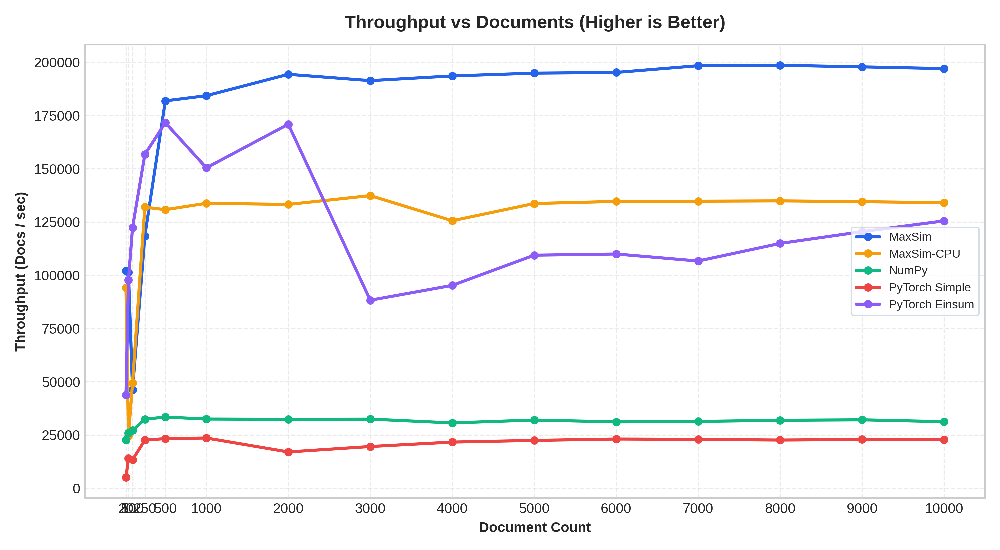

<div align="center">

#  BBQ-RAG

[](LICENSE)
[](https://www.python.org/)
[](https://www.rust-lang.org/)
[-16a34a.svg>)](#performance--benchmarks)
[](#key-features)
[](https://pyo3.rs/)
[](#)
[](#)
[](#performance--benchmarks)
[](ABOUT.md)

</div>

BBQ-RAG is a high-performance visual document retrieval and late-interaction (MaxSim) search engine. It combines Vision-Language Model embeddings (ColPali, SmolVLM, Idefics3) with an in-register fused AVX2/FMA SIMD compute kernel in Rust (`maxsimd`), achieving over 90,000 document pages scored per second on multi-core CPUs with zero intermediate heap memory allocation.

It includes an automated PDF directory watcher, a persistent background embedding server, zero-copy PyTorch/NumPy FFI bindings, and an integrated client-side Google Gemini multimodal RAG generator with graceful offline fallback.

---

## Key Features

- **Fused AVX2 MaxSim Kernel**: 4-way query unrolled SIMD dot-product pipeline with in-register maximum tracking, eliminating intermediate similarity matrix allocation and cutting memory load traffic by 27x.
- **Adaptive Parallelism**: Dynamic execution routing that executes small batches sequentially on the main thread to avoid work-stealing overhead, and switches to Rayon chunked work pools for large multi-page batches.
- **Zero-Copy Memory Interop**: Direct ingestion of contiguous 2D/3D NumPy arrays via PyO3 and raw memory pointer passing (`maxsim_ptr`) for PyTorch tensors (`tensor.data_ptr()`).
- **Vision-Language Indexing Server**: Automated folder monitoring (`data/watch/`), background PDF page rasterization at 150 DPI via PyMuPDF, and persistent SQLite embedding metadata tracking.
- **Client-Side Gemini Multimodal RAG**: Seamless multimodal answer generation with Google Gemini (`gemini-3.6-flash` / `gemini-2.0-flash`) over top-3 retrieved page images, with automatic fallback to returning document pages when offline or when no API key is provided.

---

## Performance & Benchmarks

The benchmark compares 5 MaxSim scoring implementations across varying document counts (Q=32 query tokens, L=100-300 document tokens, Embedding Dim=128):



_Note: The benchmark results shown above are preliminary and generated in a synthetic test suite. The benchmark setup was generated with AI assistance and has not been independently validated across all production hardware variants. Further validation, profiling, and testing on real-world workloads are planned to ensure strict benchmark authenticity and reproducibility._

## Installation

### Prerequisites

- Python 3.10 or higher
- Rust 1.75 or higher (with `cargo`)
- x86_64 CPU supporting AVX2 and FMA instructions

### Step 1: Clone Repository & Create Virtual Environment

```bash
git clone https://github.com/cmd-HMN/bbq-rag.git
cd bbq-rag

python3 -m venv .venv
source .venv/bin/activate
```

### Step 2: Install Dependencies

```bash
pip install --upgrade pip
pip install -r requirements.txt
```

### Step 3: Compile Rust Extension

Build the high-performance release binary using `maturin`:

```bash
maturin develop --release
```

Or build a redistributable wheel:

```bash
maturin build --release -o dist/
pip install dist/bbq_rag-*.whl
```

---

## Quickstart & Usage

### 1. Configure the Engine

Edit `config.yaml` to set your model IDs, watch directory, and Gemini preferences:

```yaml
base_model_id: "HuggingFaceTB/SmolVLM-256M-Instruct"
lora_adapter_id: "vidore/colSmol-256M"
embedding_dim: 128
device: "auto"
torch_dtype: "bfloat16"

watch_folder_path: "data/watch"
pdf_render_dpi: 150

# Optional Google Gemini multimodal RAG settings
gemini_api_key: ""
gemini_model: "gemini-3.6-flash"
rag_top_k: 3
```

### 2. Start the Indexing Server

Launch the document indexing server. It will monitor `data/watch/` for new PDF files and automatically compute embeddings:

```bash
python -m bbq.src.main server --config config.yaml
```

### 3. Query Documents via CLI

Search indexed documents from the command line:

```bash
# Query top 3 matching pages
python -m bbq.src.main query "What was the operating margin in Q3?" --top-k 3

# Query with Gemini Multimodal RAG (generates grounded answer from top 3 page images)
export GEMINI_API_KEY="your-gemini-api-key"
python -m bbq.src.main query "Summarize the revenue growth" --top-k 3
```

If no Gemini API key is provided or the API is unavailable, the client automatically displays the matching document pages without crashing.

### 4. Python API Usage

#### Client Query & RAG

```python
from bbq.src.client import BBQClient
from bbq.src.config import load_configuration_from_yaml_file

config = load_configuration_from_yaml_file("config.yaml")
client = BBQClient(server_url="http://localhost:8000", config=config)

response = client.query_and_answer(
    query_text="Explain the cash flow breakdown in the report",
    top_k=3,
)

if response["answer"]:
    print("Gemini Multimodal Answer:\n", response["answer"])
else:
    print("Retrieved Book Pages (Fallback):")
    for source in response["sources"]:
        print(f"File: {source['file_path']} | Page: {source['page_number']} | Score: {source['score']:.4f}")
```

#### Direct Zero-Copy MaxSim in Python

```python
import numpy as np
import maxsimd

# Query matrix: shape (32, 128)
q_mat = np.random.randn(32, 128).astype(np.float32)

# 2D Document matrix: shape (1024, 128)
d_2d = np.random.randn(1024, 128).astype(np.float32)
score = maxsimd.maxsim(q_mat, d_2d)
print("Single Document Score:", score[0])

# 3D Multi-Page Document: shape (4, 1024, 128)
d_3d = np.random.randn(4, 1024, 128).astype(np.float32)
page_scores = maxsimd.maxsim(q_mat, d_3d)
print("Page Scores:", page_scores)
```

#### Direct PyTorch Raw Pointer Scoring (`tensor.data_ptr()`)

```python
import torch
import maxsimd

q_tensor = torch.randn(32, 128, dtype=torch.float32)
d_tensor = torch.randn(4, 1024, 128, dtype=torch.float32)

# Pass raw memory pointers without creating numpy views or copying tensors
scores = maxsimd.maxsim_3d_ptr(
    q_tensor.data_ptr(),
    d_tensor.data_ptr(),
    32,    # q_len
    4,     # num_pages
    1024,  # tokens_per_page
    128    # dim
)
print("PyTorch Pointer MaxSim Scores:", scores)
```

---

## Testing & Verification

Run the full integration test suite and Rust unit tests:

```bash
# Run Python integration and regression tests (7 test suites)
python3 -m pytest

# Run Rust unit tests (47 tests for BLAS and AVX2 kernels)
cargo test

# Run scaling benchmark suite and generate Matplotlib graphs
python3 benchmarks/benchmark_maxsim.py
```

---

## Roadmap & TODO

- [ ] **Int8 Scalar / Vector Quantization**: Implement 8-bit quantized embedding support with AVX2 / AVX-512 VNNI (`_mm256_dpbusd_epi32`) instructions to reduce memory footprint by 4x (~125 MB per 1,000 pages).
- [ ] **Binary & 2-bit Quantization**: Add binary Hamming distance fast-filtering for multi-million document candidate pre-ranking.
- [ ] **Cross-Platform SIMD Backends**: Implement ARM NEON (Apple Silicon / AWS Graviton) and AVX-512 dedicated kernels.
- [ ] **Hardware Prefetching**: Integrate software cache prefetching (`_mm_prefetch`) for subsequent document token cache lines in the streaming loop.
- [ ] **GPU-Accelerated MaxSim**: Add optional CUDA / Triton / wgpu kernel for batched document scoring across >100,000 documents.(opitional)
- [ ] **ViDoRe Benchmark Evaluation**: Run comprehensive visual document retrieval evaluations against standard datasets (ViDoRe, DocVQA, InfoVQA).
- [ ] **Multi-Platform CI/CD**: Set up automated GitHub Actions matrix testing for Linux (x86_64), macOS (ARM64), and Windows.
- [ ] **Audit Boilerplate & Fix Errors for Scalability**: Review and harden all boilerplate code, fix edge-case runtime errors, eliminate redundant allocations, and optimize the codebase for production-grade throughput and scalability.
- [ ] **Eliminate Circular Dependencies**: Audit and refactor inter-module imports across `client`, `server`, `storage`, and `config`.
- [ ] **Origins & Attribution Reference**: See [ABOUT.md](ABOUT.md) for full project lineage, paper citations ([ColPali arXiv:2407.01449](https://arxiv.org/abs/2407.01449)), `maxsim-cpu` references, and reserved rights notices.

---

## Acknowledgments & Lineage

BBQ-RAG builds upon the foundational research and open-source contributions of the visual document retrieval community:

- **ColPali**: Concept inspired by the paper _"ColPali: Efficient Document Retrieval with Vision Language Models"_ ([arXiv:2407.01449](https://arxiv.org/abs/2407.01449)) and the [`illuin-tech/colpali`](https://github.com/illuin-tech/colpali) codebase by Manuel Faysse et al.
- **maxsim-cpu**: Inspired by and benchmarked in reference to [`maxsim-cpu`](https://pypi.org/project/maxsim-cpu/) for CPU late-interaction scoring.

We express our sincere thanks to the original authors and maintainers for their pioneering contributions. All original rights, architectures, paper concepts, and model weights remain reserved to their respective authors and institutions.

For full project lineage, paper citations, and intellectual property notices, see [ABOUT.md](ABOUT.md).

---

## Disclaimer

This project, its documentation, and parts of its codebase and benchmarks were developed with the assistance of AI tools. As an evolving early-stage project, this README and documentation may contain preliminary assumptions or specifications that are actively being refined. Future commits will continuously audit, validate, and update these details to ensure ongoing accuracy, correctness, and benchmarking rigor. No warranties or guarantees of fitness for a particular purpose are provided.
