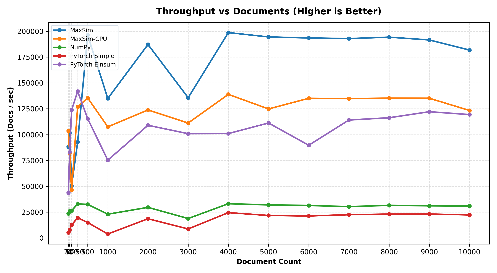
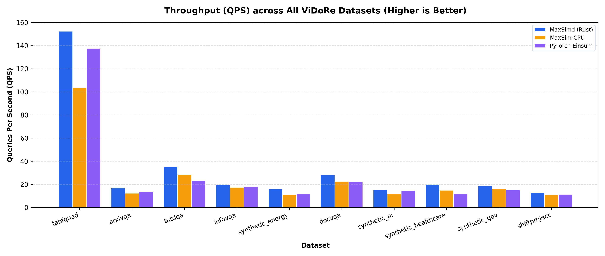
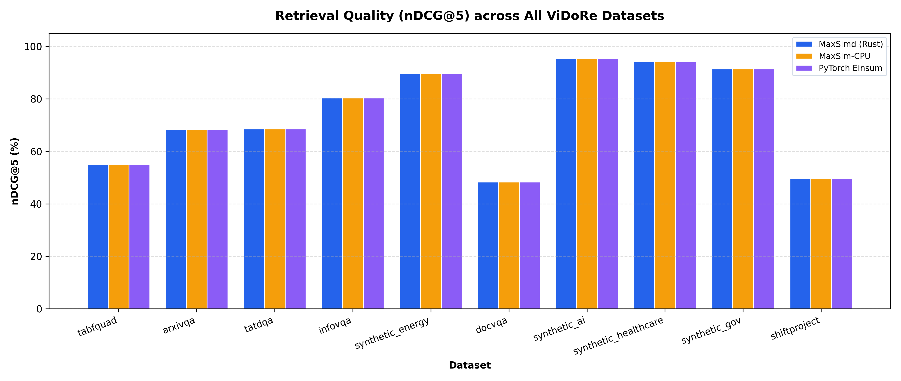
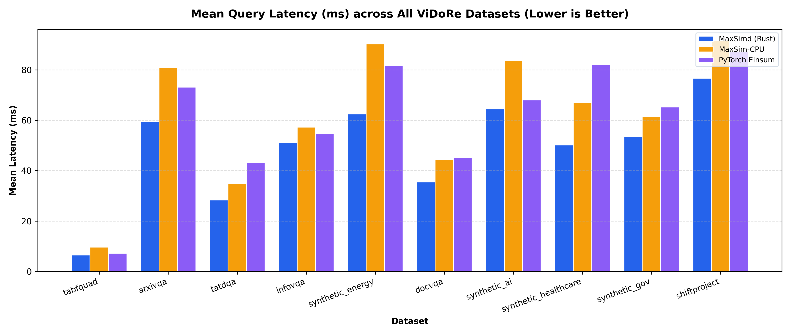

# BBQ-RAG Benchmark Suite

This directory contains a modular benchmarking and evaluation suite designed to measure the latency, throughput, retrieval accuracy (nDCG@5), and algorithmic parity of the `maxsimd` Rust SIMD engine against standard CPU baselines and real-world multimodal retrieval workloads.

---

## Overview of Benchmark Suites

The benchmark runner is organized into two primary suites:

### 1. `maxsimd` (Microbenchmark & Scaling Suite)

Evaluates raw token late-interaction (MaxSim) performance across synthetic workloads with varying document batch sizes (e.g., 20 to 10,000+ documents):

- **`maxsimd.maxsim`**: Unified SIMD AVX2/FMA + Rayon multithreaded engine with zero-copy PyTorch/NumPy buffer ingestion.
- **`maxsim-cpu`**: Official [`maxsim-cpu`](https://pypi.org/project/maxsim-cpu/) PyPI package (`maxsim_scores`).
- **`PyTorch Einsum`**: Vectorized batch `torch.einsum` baseline.
- **`PyTorch Simple`**: Iterative tensor dot-product baseline.
- **`NumPy`**: Reference pure NumPy baseline.



### 2. `vidore` (Macrobenchmark & Retrieval Quality Suite)

Evaluates end-to-end visual document retrieval on real datasets from the [ViDoRe (Visual Document Retrieval) Benchmark](https://huggingface.co/vidore):

- Measures information retrieval quality: **nDCG@5**, **MRR**, **Recall@k**.
- Measures serving throughput: **Queries Per Second (QPS)** and **mean latency (ms)** per query.
- Evaluates **Ranking Parity** against reference PyTorch einsum outputs to verify algorithmic parity and numerical correctness.

#### ViDoRe Serving Throughput (QPS)


#### ViDoRe Retrieval Quality (nDCG@5)


#### ViDoRe Mean Query Latency (ms)


---

## Installation & Prerequisites

Make sure the project dependencies and optional benchmark packages are installed:

```bash
# Install benchmark dependencies
pip install -e ".[benchmark]"

# Ensure the maxsimd Rust extension is compiled in release mode
maturin develop --release
```

Benchmark dependencies include `tqdm`, `matplotlib`, `jinja2`, `datasets`, and `plotly`.

---

## Running Benchmarks

You can run benchmarks directly from the repository root using `python3 benchmarks` or `python3 benchmarks/cli.py`.

### 1. Run the `maxsimd` Scaling Benchmark

```bash
# Run with default settings (all CPU cores, document range from 20 to 10,000)
python3 benchmarks --suite maxsimd

# Run sequentially (single thread)
python3 benchmarks --suite maxsimd --jobs 1

# Specify custom concurrency and document counts
python3 benchmarks --suite maxsimd --jobs 4 --docs 20 50 100 500 1000

# Custom query length and embedding dimension
python3 benchmarks --suite maxsimd --q_len 32 --dim 128
```

### 2. Run the `vidore` Retrieval Benchmark

```bash
# Run on all configured ViDoRe datasets
python3 benchmarks --suite vidore

# Run on specific datasets
python3 benchmarks --suite vidore --dataset tabfquad arxivqa docvqa

# Force re-download of datasets and re-computation of embeddings
python3 benchmarks --suite vidore --dataset tabfquad --force

# Specify custom directories for dataset cache and embeddings
python3 benchmarks --suite vidore --data-dir data/vidore --emb-dir data/embeddings
```

### 3. Run All Suites Sequentially

```bash
# By default, running without arguments executes all benchmark suites
python3 benchmarks

# Or specify all explicitly
python3 benchmarks --suite all
```

---

## CLI Options Reference

| Argument                  | Type     | Default           | Description                                                            |
| :------------------------ | :------- | :---------------- | :--------------------------------------------------------------------- |
| `--suite`                 | `str`    | `all`             | Benchmark suite to run: `all` (default, runs both), `maxsimd`, or `vidore`. |
| `--jobs`                  | `int`    | `-1`              | Number of worker threads (`-1` for all CPU cores, `1` for sequential). |
| `--docs`                  | `int...` | `20 ... 10000`    | List of document counts to benchmark in `maxsimd` suite.               |
| `--dim`                   | `int`    | `128`             | Embedding dimensionality for query and document tokens.                |
| `--q_len`                 | `int`    | `32`              | Number of query tokens.                                                |
| `--seed`                  | `int`    | `42`              | Random seed for synthetic dataset generation.                          |
| `--report`                | `bool`   | `True`            | Generate interactive HTML reports and summary plots.                   |
| `--dataset`, `--datasets` | `str...` | `None` (all)      | Specific ViDoRe dataset key(s) to benchmark.                           |
| `--force`                 | `bool`   | `False`           | Force re-download and re-embedding for ViDoRe datasets.                |
| `--data-dir`              | `str`    | `data/vidore`     | Directory where downloaded ViDoRe datasets are stored.                 |
| `--emb-dir`               | `str`    | `data/embeddings` | Directory where precomputed embeddings are cached.                     |
| `--asset`, `--asset-dir`  | `str`    | `None`            | Save `b1`/`b2` benchmark images to asset folder (`--asset` for `assets/`). If omitted, only saves in `bench/`. |

---

## ViDoRe Dataset Catalog

The `vidore` benchmark suite references datasets configured in [`assets/bench.json`](../assets/bench.json):

| Dataset Key            | HuggingFace Dataset                                  | Domain / Description                         |
| :--------------------- | :--------------------------------------------------- | :------------------------------------------- |
| `tabfquad`             | `vidore/tabfquad_test_subsampled`                    | French QA over tables & financial documents  |
| `arxivqa`              | `vidore/arxivqa_test_subsampled`                     | Scientific papers & academic QA              |
| `tatdqa`               | `vidore/tatdqa_test`                                 | Financial tabular data & complex tables      |
| `infovqa`              | `vidore/infovqa_test_subsampled`                     | Infographics visual question answering       |
| `docvqa`               | `vidore/docvqa_test_subsampled`                      | Scanned document QA (standard DocVQA)        |
| `synthetic_energy`     | `vidore/syntheticDocQA_energy_test`                  | Synthetic energy industry reports            |
| `synthetic_ai`         | `vidore/syntheticDocQA_artificial_intelligence_test` | Synthetic AI industry reports                |
| `synthetic_healthcare` | `vidore/syntheticDocQA_healthcare_industry_test`     | Synthetic healthcare & biomedical reports    |
| `synthetic_gov`        | `vidore/syntheticDocQA_government_reports_test`      | Synthetic government & public policy reports |
| `shiftproject`         | `vidore/shiftproject_test`                           | The Shift Project climate policy reports     |

---

## Generated Artifacts & Reports

When `--report` is enabled (default), benchmark results and visual reports are output to the `bench/` directory:

- **Interactive HTML Reports**:
    - `bench/maxsimd/maxsimd_benchmark.html`: Interactive Plotly throughput curves and statistical measurement tables (Mean ± Std, Throughput).
    - `bench/vidore/vidore_suite_benchmark.html`: Multi-dataset comparison charts for Throughput (QPS), Retrieval Quality (nDCG@5), and Rank Parity.
- **High-Resolution Plots**:
    - [`assets/b1.png`](../assets/b1.png) & `bench/maxsimd/images/b1.png`: Matplotlib rendering of MaxSim SIMD throughput scaling across document counts.
    - [`assets/b2.png`](../assets/b2.png) & `bench/vidore/images/b2.png`: Grouped bar chart comparing ViDoRe retrieval throughput (QPS) across all benchmark datasets.
    - [`assets/b2_ndcg5.png`](../assets/b2_ndcg5.png) & `bench/vidore/images/b2_ndcg5.png`: ViDoRe retrieval accuracy (nDCG@5) comparison.
    - [`assets/b2_latency.png`](../assets/b2_latency.png) & `bench/vidore/images/b2_latency.png`: ViDoRe mean query latency comparison.
